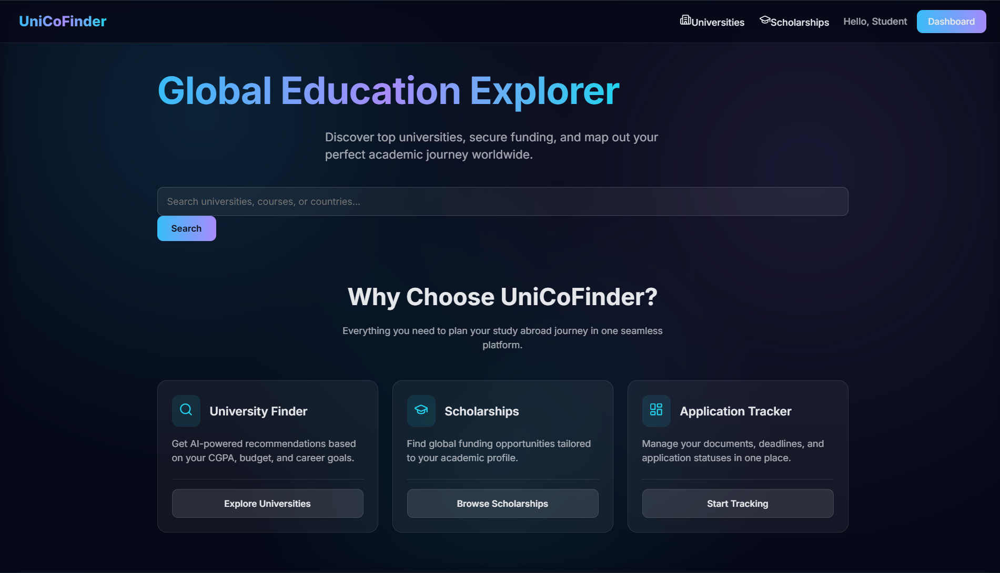
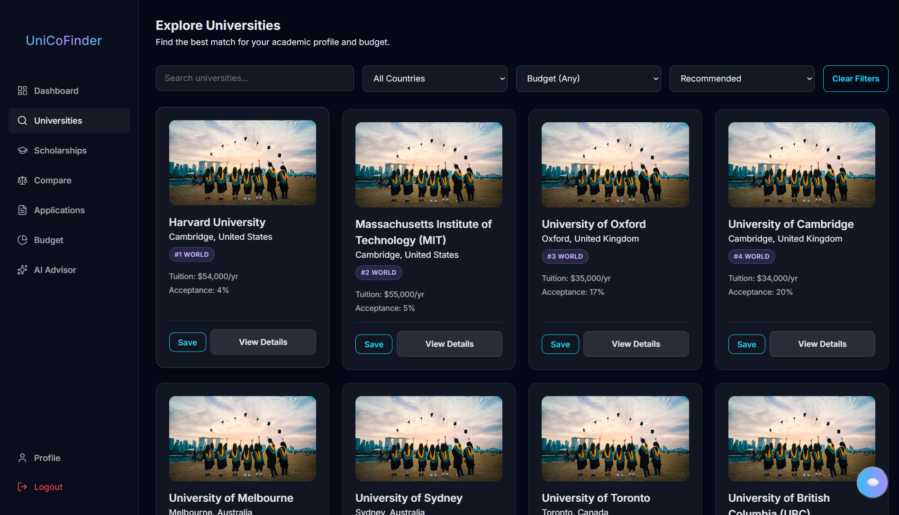
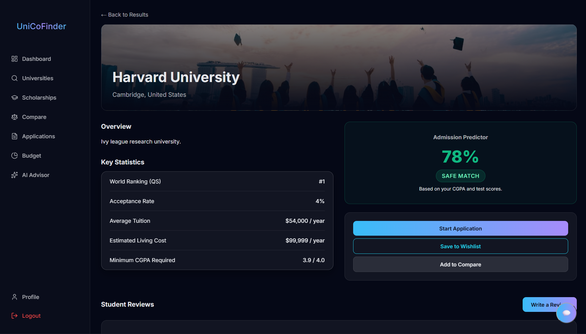
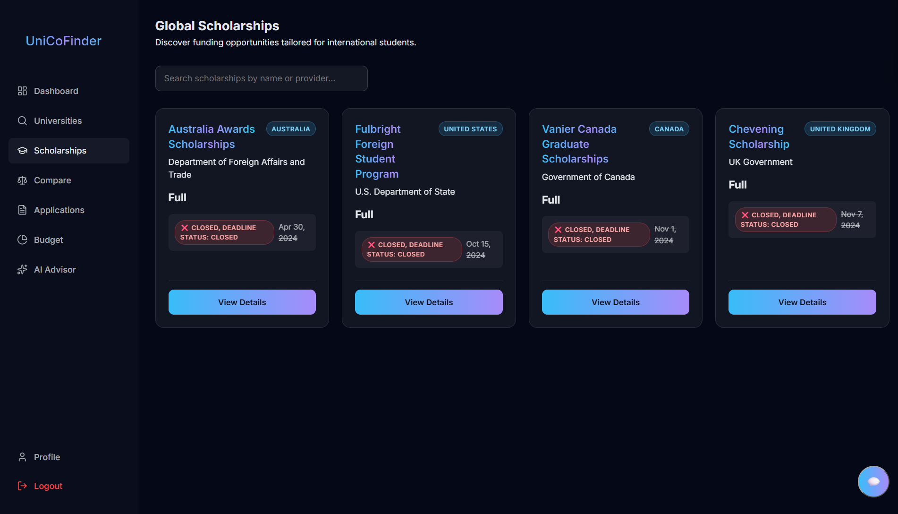
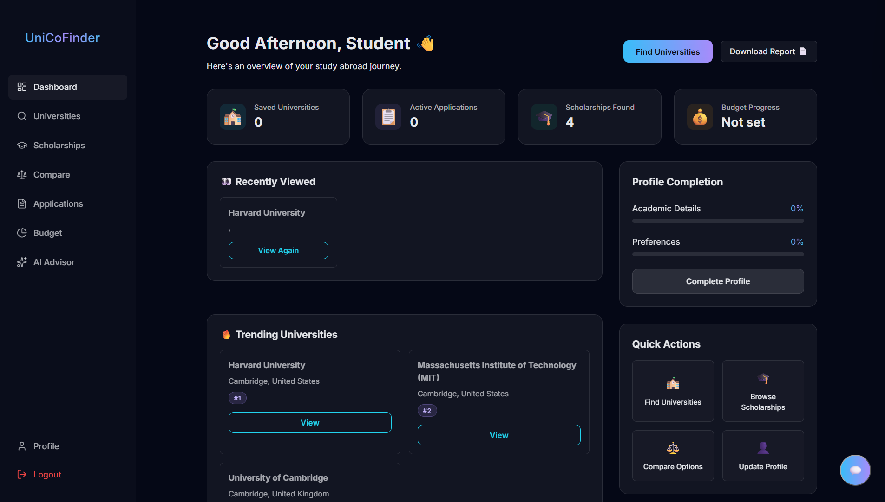
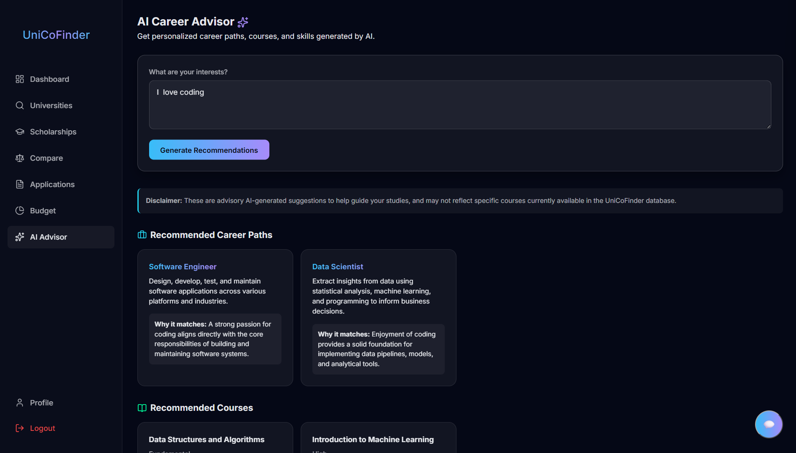
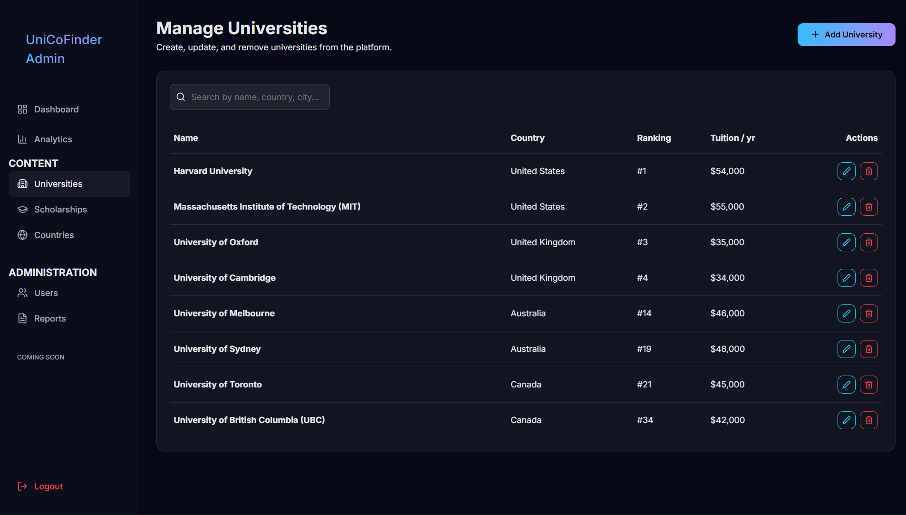

# UniCoFinder – Smart Study Abroad Advisor

UniCoFinder is a modern MERN Stack web application designed to help students discover the best universities, countries, scholarships, and estimate admission chances based on their academic profile, budget, and career goals.

---

## 🚀 Production Links

- **Frontend (Vercel)**: [https://unicofinder.vercel.app/](https://unicofinder.vercel.app/)
- **Backend API (Render)**: [https://unicofinder.onrender.com](https://unicofinder.onrender.com)
- **API Health Check**: [https://unicofinder.onrender.com/api/health](https://unicofinder.onrender.com/api/health)

## 📖 Overview & Features

UniCoFinder combines everything needed for study abroad planning into one platform:
- **University Recommendation**: Matches CGPA, course, and budget to find universities.
- **Country Explorer**: Suggests countries based on budget and opportunities.
- **Scholarship Finder**: Matches scholarships based on academic scores.
- **Admission Predictor**: Calculates safe, target, and dream university chances.
- **Wishlist & Tracker**: Save universities and track applications from start to finish.
- **Budget Calculator**: Compare tuition and living costs.

## 🛠️ Technology Stack & Architecture

- **Frontend**: React, Tailwind CSS, Vite (Deployed on Vercel)
- **Backend**: Node.js, Express.js, Mongoose (Deployed on Render)
- **Database**: MongoDB Atlas
- **Authentication**: JWT
- **Architecture**: Vercel frontend → Render backend → MongoDB Atlas.

## 📚 Documentation

Detailed documentation is available in the `docs/` folder:
- [Installation Guide](docs/Installation.md)
- [API Documentation](docs/API.md)
- [System Architecture](docs/architecture.md)
- [Product Requirements](docs/PRD.md)
- [Development Roadmap](docs/Todo.md)

## 📸 Application Screenshots

Here are some previews of the live production application:

- **Home Page**:  
  
- **Universities**:  
  
- **University Details**:  
  
- **Scholarships**:  
  
- **Dashboard**:  
  
- **AI Advisor**:  
  
- **Admin Dashboard**:  
  

## ⚙️ Prerequisites & Setup

Please refer to the detailed [Installation Guide](docs/Installation.md) for step-by-step instructions.

### Quick Start
1. **Clone**: `git clone https://github.com/rini02vit/UniCoFinder.git`
2. **Install**:
   ```bash
   npm install
   cd client && npm install
   cd ../server && npm install
   ```
3. **Configure Environment**: Copy `server/.env.example` to `server/.env` and fill in secrets (like `MONGO_URI`, `JWT_SECRET`). *Never commit real secrets!*
4. **Run Backend**: `cd server && npm run dev`
5. **Run Frontend**: `cd client && npm run dev`

### Available Scripts (Root)
- `npm run lint` — Lints both `client` and `server`.
- `npm run format` — Formats files via Prettier.
- `npm run format:check` — Validates formatting.

## 🚀 Deployment

The app is configured for seamless deployment:
- **Frontend** is deployed automatically via Vercel.
- **Backend** is deployed via Render. Ensure environment variables (like `MONGO_URI` and `FRONTEND_URL`) are configured in the Render dashboard.

## 🔮 Future Improvements

Based on our completed implementations and roadmap, future improvements may include:
- AI-powered SOP Generator & Resume Analyzer
- Visa Interview Simulator
- Scholarship Success Predictor
- Real-time University API Integration
- Mobile App (React Native) or Progressive Web App (PWA)
- Multi-language Support
- Multi-instance-safe scheduled jobs / external job queue for background tasks
- Stronger production observability & error tracking

## 📁 Folder Structure

```text
UniCoFinder/
├── client/                 # React Frontend (Vite)
├── server/                 # Express Backend
│   ├── config/             # DB & Config
│   ├── controllers/        # Route controllers
│   ├── middleware/         # Custom middleware
│   ├── models/             # Mongoose schemas
│   ├── routes/             # API route definitions
│   └── server.js           # Entry point
├── docs/                   # Documentation
├── eslint.config.js        # Global ESLint rules
├── .prettierrc             # Global Prettier rules
└── package.json            # Root dependency manager
```
